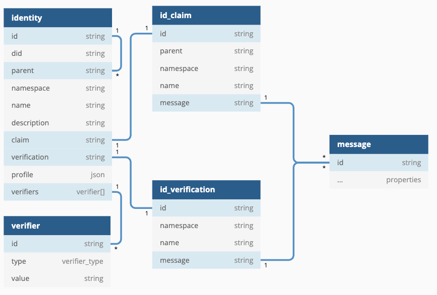

- Feature Name: extensible_identity_resolution
- Start Date: 2022-01-07
- FIR PR: (leave this empty)
- FireFly Component: Identity Manager
- FireFly Issue: (leave this empty)

# Summary

[summary]: #summary

Provide a global scheme for specifying signing identities, which can be resolved to the associated signing keys to use with the different underlying DLTs that FireFly uses.

# Motivation

[motivation]: #motivation

As of now, FireFly defines a `key` construct for objects that needs signing keys, using the scheme taken directly from the underlying DLT protocols. For instance, when used with Ethereum, a `key` value takes the `0x1234...abcd` format, whereas with Fabric, a `key` value can be either the short name like `user1`, or the fully resolved string `org1::x509::CN=fabric-ca::CN=user1`.

As a result, the DLT specific values can be spreading across an application code base using FireFly. This is not optimal as FireFly strives to mask differences among the different DLT technologies as much as possible.

In addition, FireFly also defines an `author` construct that identifies the signer, but still requires the separate `key` property to be provided alongside. Where we'd like for FireFly to be is for the signing keys to bound under the signer's identifier, so that the signer identifier is the only required parameter. This is also critical to supporting key rotations. Currently when a signing key is rotated, the application configuration must be updated accordingly which is not ideal.

FireFly has a set of pre-defined rules for verification of identity according to the below table from https://github.com/hyperledger/firefly/issues/187.

These extend to identity types of `Organization` that exist today as a built-in identity type, but there is no possibility to extend beyond these for application defined identities that are in a tree of children below and organization and have custom attributes.


# Guide-level explanation

[guide-level-explanation]: #guide-level-explanation

This FIR extends the two core identity types of `Organization` and `Node` to be built on a generic `Identity` resource, in order to:

1. Make identity extensible by applications, allowing broadcast of granular application-specific identities in a tree under an organization
2. Allow multiple signing keys to be registered by a single identity, for key rotation scenarios, and multiple key types/uses
3. Allow minimum viable DID documents to be obtained for FireFly backed identities
4. Provide a model that is designed for future extensibility to externally verifiable DID backed identities (implementation out of scope for this FIR)

All `Identity` resources behave as `Organization` does today, in that:
- Name must be unique (now scope to a `namespace` and `type`)
- Are broadcast to the network (with an associated `message`)
- Have a `profile`
- Have a `parent` (required for every `Identity` except a root `Organization` type `Identity`)

### API changes

- `GET`/`POST` `/network/organizations/*` - **changed** JSON payload for the `organization` resource (detail below)
- `GET`/`POST` `/network/nodes/*` - **changed** JSON payload for the `node` resource (detail below)
- `GET`/`POST` `/namespaces/{ns}/identities/*` - **new** resource collection to broadcast/query namespace scoped `identity` resources

### Database updates



- **remove** `organizations` database collection
- **remove** `nodes` database collection
- **add** `identities` database collection
- **add** `signing_keys` database collection

### Resource changes

- `Organization` resources will now be stored as `Identity` resources:
  - `namespace` - `ff_system`
  - `type` - `organization`
  - `parent` - must be of type `organization` or `null` - **only** organizations can be root identities
- `Node` resources will now be stored as `Identity` resources:
  - `namespace` - `ff_system`
  - `type` - `node`
  - `parent` - must be of type `organization`
- `Identity` new resource type that can be defined by a user within a namespace
  - `namespace` - any
  - `type` - **must** be `custom` for user-defined objects
  - `parent` - must be of type `organization` or `custom`

### DID Support

To find a global identity scheme that supports resolution to (possibly multiple) signing keys, and can support any DLT protocols, we need not look any further than the DID technologies (Decentralized Identifiers). This is a W3C specification that defines a universal mechanism to represent an identity (people, orgs, things) that holds cryptographic keys. The design of the DID architecture consists of two high level parts: the `DID string` and the `DID document`. The string is used as the unique identifier that resolves to the document which provides rich information about the identity, such as public keys and verification methods.

Details of the DID specification can be found at [https://www.w3.org/TR/did-core/](https://www.w3.org/TR/did-core/).

Given the already defined namespace `did:firefly`, we want to be able to generate a [DID Document](https://www.w3.org/TR/did-core/#example-1-a-simple-did-document) via a REST API.

The DID URI schemes for the three current supported identity types proposed are:

- `org`: `did:firefly:org/{UUID}` - note shift from UUID
- `org`: `did:firefly:org/acme` (existing)

Given an organization identity string `did:firefly:org/acme`, a DID Document like the following must be returned by the identity manager:

```
{
  "@context": [
    "https://www.w3.org/ns/did/v1",
    "https://w3id.org/security/suites/ed25519-2020/v1"
  ]
  "id": "did:firefly:org/acme",
  "verificationMethod": [{
    "id": "did:firefly:org/acme#0xb9c5714089478a327f09197987f16f9e5d936e8a",
    "type": "EcdsaSecp256k1VerificationKey2019",
    "controller": "did:firefly:org/acme",
    "blockchainAcountId": "0xb9c5714089478a327f09197987f16f9e5d936e8a"
  }, {
    "id": "did:firefly:org/acme#keys-2",
    "type": "X25519KeyAgreementKey2019",
    "controller": "did:firefly:org/acme",
    "publicKeyMultibase": "z9hFgmPVfmBZwRvFEyniQDBkz9LmV7gDEqytWyGZLmDXE"
  }],
  "authentication": [
    "#0xb9c5714089478a327f09197987f16f9e5d936e8a"
  ],
  "keyAgreement": [
    "#keys-2"
  ]
}
```

Some detailed explanations about the above example:

- the first verification method, with the type `EcdsaSecp256k1VerificationKey2019`, is for verifying digital signatures. This is evident in the `authentication` section which specifies the public key to use when authenticating an incoming signed request.
- the public key for the first key entry is not specified, but instead an `blockchainAccountId` is specified with the standard 20-byte account address. This is following the convention used by the Ethereum community to match a digital signature to the signing address in the place of the public key.
- the second verification method, with the type `X25519KeyAgreementKey2019`, is for encryption purposes. This is evident in the `keyAgreement` section which specifies the public key to use when negotiating encryption keys for secure data exchange. One potential usage of such a key entry is in the data exchange module.
- Other [Verification Relationships](https://www.w3.org/TR/did-core/#verification-relationships) are currently not used in the context of FireFly.

Below is an example of a Fabric based verification method entry:

```
{
  "id": "did:firefly:org/acme#user1",
  "type": "HyperledgerFabricMSPIdentity",
  "controller": "did:firefly:org/acme",
  "mspIdentityString": "mspIdForAcme::x509::CN=fabric-ca::CN=user1"
}
```

- The `type` property is set to `HyperledgerFabricMSPIdentity` because it represents an identity backed by certificates (all Fabric identities must be backed by x.509 or idmixer certificates) and follows the Fabric MSP verification rules
- Because the certificates themselves contain digital signing algorithm information on the signing key, the type value does not need to provide that information
- The `mspIdentityString` property specifies the concise format for the certificate chain that must be matched by the signature. For details of the Fabric signing rules, refer to [the Fabric documentation](https://hyperledger-fabric.readthedocs.io/en/release-2.4/msp.html)
- The sample value `mspIdForAcme::x509::CN=fabric-ca::CN=user1` applies to x.509 certificates. Certificates based on idmixer will be discussed in a future revision

# Reference-level explanation

[reference-level-explanation]: #reference-level-explanation

No additional information is needed here.

# Drawbacks

[drawbacks]: #drawbacks

# Rationale and alternatives

[alternatives]: #alternatives

There are existing implementations of DIDs for Ethereum, and Fabric, such as [the Ethereum DID Resolver](https://github.com/decentralized-identity/ethr-did-resolver) and [Hyperledger Labs TrustID](https://github.com/hyperledger-labs/trustid).

Both of the above, and most of the other existing implementations, are based on the underlying DLT ledger (or blockchain) to maintain the DID registry and resolve the DID documents. FireFly already provides a pluggable mechansim to register and broadcast identities. Registries based on blockchains is but one type of plugin.

[trustbloc/orb](https://github.com/trustbloc/orb) is an implementation of the [DIF SideTree](https://identity.foundation/sidetree/spec/) specification, which describes a network of nodes that manages the lifecycle (CRUD) operations and propagation of DIDs. The spec focuses on a trustless design that requires witnesses to provide proofs for a proposed identity, and relies on an underlying DLT/blockchain for a globally ordered history of operations on the DID. FireFly strives to provide a flexible suite of implementations for managing identities within the multiparty system. This goal implies FireFly must support identity registries that have different trust assumptions. In addition to a trustless design as in SideTree, a centralized approach can be appropriate for many use cases.

# Prior art

[prior-art]: #prior-art

The projects mentioned above made up the bulk of the prior art relevant to this proposal.

# Testing

[testing]: #testing

Existing unit tests and e2e tests will be sufficient to test the new feature, after being adapted to work with the new approach.

# Dependencies

[dependencies]: #dependencies

None

# Unresolved questions

[unresolved]: #unresolved-questions

- what other schemes than `did:firefly:org` should be considered, for FireFly to support more types of identities than organizations? `did:firefly:node`, `did:firefly:user`?
- the Data Exchange component should switch to using the DID Document based key agreement set up, but it's not clear if there are practical benefits than architectural consistency. More discussions with the developers of that components are needed
