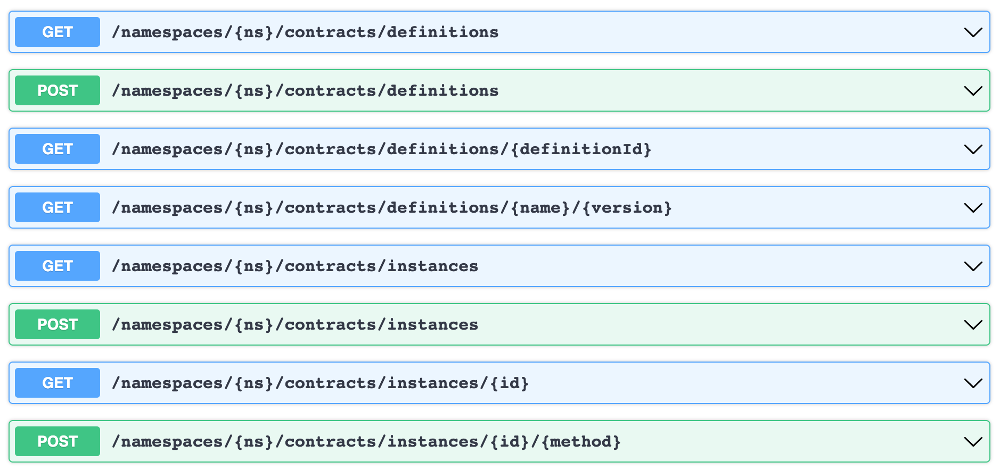

- Feature Name: Custom On-Chain Logic
- Start Date: 2021-11-10
- FIR PR: (leave this empty)
- FireFly Component: firefly
- FireFly Issue: (leave this empty)

# Summary

[summary]: #summary

The Custom On-Chain Logic introduces a new set of unified APIs for FireFly to invoke any smart contract and subscribe to events emitted from that contract. It also introduces a consistent way to describe the interface of a smart contract, including its functions, parameters, and events, in a way that is abstracted from a specific blockchain implementation.

> Note: Deployment of smart contracts is not in scope of this improvement request.

# Motivation

[motivation]: #motivation

Many FireFly users have requested the ability to interact with custom smart contracts through FireFly. This is one of the major features planned for v1.0. Right now, custom smart contracts can be invoked directly through FireFly's blockchain connectors, but these APIs are specific to each blockchain connector. Today, there is no way to change blockchain implementations without also changing API calls to interact with a custom contract. The goal of this feature is to have a set of APIs in the FireFly Core which allow users to swap out FireFly plugins such as the blockchain connector, without needing to change any API calls made to FireFly's API.

# Guide-level explanation

[guide-level-explanation]: #guide-level-explanation

With this enhancement, FireFly exposes a simple set of APIs to work with custom smart contracts. Given a smart contract on a blockchain, these APIs will allow an end user to:

1. Describe the interface of the smart contract including its functions and events in a standardized format. This format is currently called an FFABI, but will likely change. This is called a **Contract Definition**. Contract definitions require a name and version that is unique within their namespace.

   `POST /namespaces/{ns}/contracts/definitions`

2. Tell FireFly where a specific instance of this contract exists on-chain. This is called a **Contract Instance**. Optionally, allow the user to give the specific instance a friendly name.

   `POST /namespaces/{ns}/contracts/instances`

3. Invoke functions on the contract instance while validating input

   `POST /namespaces/{ns}/contracts/instances/{id}/{method}`

4. Subscribe to events emitted from the contract instance
5. Receive these events over FireFly's existing event bus

## New API Endpoints



> Note: A more detailed reference for expected request bodies and responses is required in this section

# Reference-level explanation

[reference-level-explanation]: #reference-level-explanation

## Contract Definitions

- Describe the interface of a smart contract on-chain to enable FireFly to create an API to interact with them
- Are namespaced, like most other FireFly resources
- Must have a unique name and version combination within their namespace
- When a contract definition is created in FireFly, it is broadcasted to all other members in the network, via the existing broadcast function of FireFly. It is broadcasted on the same namespace that it is created in.
- Will be stored in a new table in the FireFly Core database called `contract_definitions` for fast access during runtime

### Proposed JSON representation

```json
{
  "id": "19924a2c-fdf5-460d-ac3b-a8e377b4f553",
  "name": "simple-storage",
  "version": "v0.1.0",
  "ffabi": {
    "methods": [
      {
        "name": "set",
        "params": [
          {
            "name": "newValue",
            "type": "int"
          }
        ],
        "returns": []
      },
      {
        "name": "get",
        "params": [],
        "returns": [
          {
            "name": "output",
            "type": "int"
          }
        ]
      }
    ],
    "events": [
      {
        "name": "Changed",
        "params": [
          {
            "name": "from",
            "type": "string"
          },
          {
            "name": "value",
            "type": "int"
          }
        ]
      }
    ]
  }
}
```

## Contract Instances

- Points to a specific instance of a smart contract on-chain
- Are namespaced, like most other FireFly resources
- Can be given a friendly name if the name is unique within the namespace
- When a contract instance is created in FireFly, it is broadcasted to all other members in the network, via the existing broadcast function of FireFly. It is broadcasted on the same namespace that it is created in.
- Will be stored in a new table in the FireFly Core database called `contract_instances` for fast access during runtime.

### Proposed JSON representation

### Creating a contract instance

```json
{
    "name": "myStorage",
    "onChainLocation": "0xb00a83bbe11e74f31784736ec4428c3239464fb2",
    "contractDefinition": {
        "id": "19924a2c-fdf5-460d-ac3b-a8e377b4f553"
    }
}
```

### Looking up a contract instance

```json
{
    "id": "b3918b7f-f0d9-4724-9813-74f958d95957",
    "namespace": "default",
    "name": "simple-storage",
    "version": "v0.1.0",
    "ffabi": {
        "Methods": [
            {
                "Name": "set",
                "Params": [
                    {
                        "Name": "newValue",
                        "Type": "int"
                    }
                ],
                "Returns": []
            },
            {
                "Name": "get",
                "Params": [],
                "Returns": [
                    {
                        "Name": "output",
                        "Type": "int"
                    }
                ]
            }
        ],
        "Events": [
            {
                "Name": "event1",
                "Params": [
                    {
                        "Name": "_from",
                        "Type": "string"
                    },
                    {
                        "Name": "_value",
                        "Type": "int"
                    }
                ]
            }
        ]
    }
}
```

# Drawbacks

[drawbacks]: #drawbacks

There are no known drawbacks at this time.

# Rationale and alternatives

[alternatives]: #alternatives

- Why is this design the best in the space of possible designs?
- What other designs have been considered and what is the rationale for not
  choosing them?
- What is the impact of not doing this?

# Prior art

[prior-art]: #prior-art

The Ethereum ABI format may inform part of the design for FireFly's Contract Definition format.

# Testing

[testing]: #testing

- What kinds of test development and execution will be required in order
  to validate this proposal, beyond the usual mandatory unit tests?
- List integration test scenarios which will outline correctness of proposed functionality.

# Dependencies

[dependencies]: #dependencies

-

# Unresolved questions

[unresolved]: #unresolved-questions

- Final name of FFABI?
- Format of FFABI?
