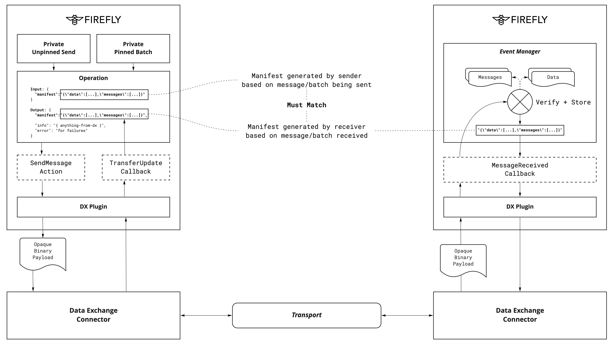

- Feature Name: Data Exchange Manifests
- Start Date: 2022-01-11
- FIR PR: (leave this empty)
- FireFly Component: FireFly Core
- FireFly Issue: (leave this empty)

# Summary
[summary]: #summary

Extension to the DX plug-point to allow the transmission of receipt manifests
from a target FireFly, back to the source FireFly, to confirm delivery.

Authors: @gabriel-indik, @jimthematrix, @peterbroadhurst

# Motivation
[motivation]: #motivation

To allow data exchange plugins to provide confirmation of delivery.

# Guide-level explanation
[guide-level-explanation]: #guide-level-explanation

- The `Cababilities` for the DX plugin are enhanced with a `Manifest` boolean
- The `operation` `input` for data transfers enhanced with a `manifest`
  - The `manifest` is generated as a function of the existing `TransportWrapper`
  - Contains a JSON string with the `messages` and `data` in order
  - The sender generates this and stores it in the `operation`, but does **not**
    pass it to Data Exchange.
- The return of the `MessageReceived()` callback is enhanced to return a `string`
  - This is passed to DX on return, for it to use as the `manifest`
  - This means the receiver _independently_ generates the `manifest`
- If the DX plugin advertises `Manifest` capability, it must transfer the
  `manifest` unchanged to the sender
  - DX implementations are encouraged to provide e2e security on this, so it
    can be treated as a proof of receipt.
- The `TransferUpdate()` callback is enhanced with a `manifest` field in
  addition to the current `info`
  - FireFly core checks the `manifest` field matches that stored in the `input`
  - The `operation` `output` is unchanged (no need to store the `manifest` a
    2nd time, as it is in the `input`)

# Reference-level explanation
[reference-level-explanation]: #reference-level-explanation

See above.

# Drawbacks
[drawbacks]: #drawbacks

None known to the authors, noting this is an extensibility point rather than
a complete implementation.

# Rationale and alternatives
[alternatives]: #alternatives

Alternatives considered:
- Transferring the manifest from sender to receiver, and asking the receiver
  to simply confirm it matches.
  - With input from @jimthematrix and @gabriel-indik this was considered
    less desirable than requiring the receiver to independently generate the
    same manifest.
- Implementing full e2e delivery receipts as a 1st class object, separate to
  operations
  - This is not ruled out in the future, but the scope of doing this was
    considered too large to be contained by the maintainers at this time.
- More sophisticated proof technologies, built into the FireFly core layer
  - The choice to leave the mechanism of cyrptography to the DX implementation
    was intentional, allowing innovation appropriate to different transports
    at the DX layer. This is consistent with the fact that the transport
    key management is already contained within the DX layer, and as such it's
    likely proof cryptography would be aligned with the transport security keys.

# Prior art
[prior-art]: #prior-art

The concept of independent generation of equivalent data strings, based on a
set of inputs, is a well proven method of comparing results of execution.

# Testing
[testing]: #testing

UT only is proposed for the introduction of this extensibility point.

# Dependencies
[dependencies]: #dependencies

None

# Unresolved questions
[unresolved]: #unresolved-questions

None
