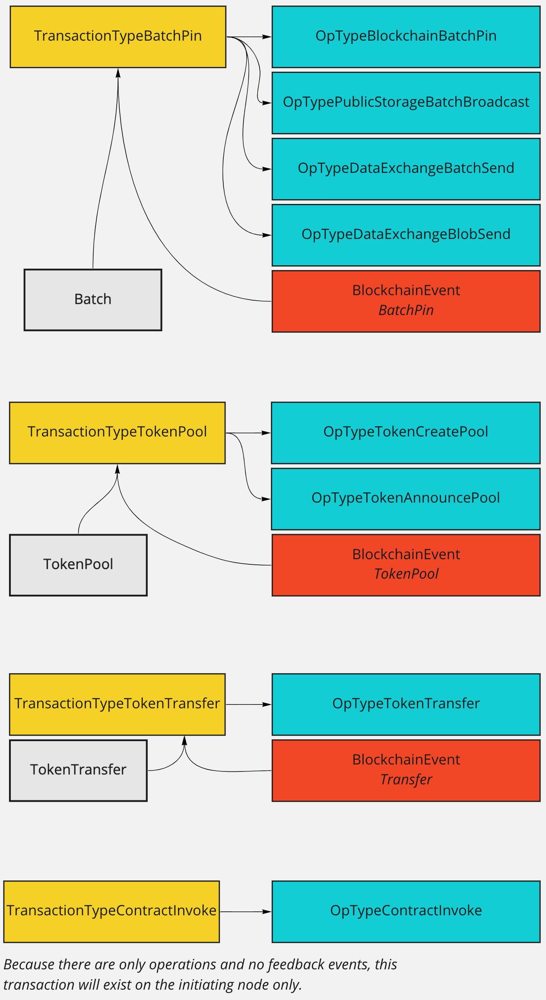

- Feature Name: Transaction Rework
- Start Date: 2022-01-27
- FIR PR: (leave this empty)
- FireFly Component: (fill me in with underlined FireFly component, core, orderer/consensus and etc.)
- FireFly Issue: (leave this empty)

# Summary
[summary]: #summary

FireFly contains a construct called a `Transaction`, but the exact purpose of this item has been
poorly defined. As a result, it has come to serve multiple purposes in the system, but all of them
incompletely.

The goal of this improvement is to clearly define the scope and purpose of a `Transaction` going
forward.

# Motivation
[motivation]: #motivation

The original requirements for what defines a FireFly `Transaction` (as of v0.11.5) were:
- Provides a container for grouping related async operations together
- Provides an overall "status" of pending/successful/failed
- Corresponds to exactly 1 blockchain transaction, which emits exactly 1 event
- Records interesting data from the blockchain, such as signer, block number, and transaction hash

However, this definition has become problematic as the system evolves:
- It's impossible or difficult to represent a group of operations that triggers no blockchain transaction,
  or that triggers multiple blockchain transactions, or a blockchain transaction with multiple events
- The "status" field is inconsistently updated, such that it's almost always useless and requires
  separate queries to other APIs to determine if a transaction has succeeded or not
- The `BlockchainEvent` type introduced in FIR #2 has become a better home for interesting blockchain
  data, and now overlaps with some of what is recorded in `Transaction`

It's clear that some cleanup is needed to resolve these problems and allow `Transaction` to cover
future needs as new use cases are added.

# Guide-level explanation
[guide-level-explanation]: #guide-level-explanation

A FireFly `Transaction` is a fundamental unit of work in the system. It is first of all a container that
can tie together:
- One or more related `Operations`, which may trigger work via on- or off-chain plugins
- Zero or more `BlockchainEvents`, which record blockchain feedback
- Any new FireFly object that is generated as a result of the work, such as a `Batch` or `TokenTransfer`

Additionally, a FireFly `Transaction` frequently maps 1:1 to a blockchain transaction (though it
may map to zero or many). In all cases, it stores a list of identifiers for the related blockchain
transaction(s), for easy mapping such as when cross-referencing with a block explorer.

Finally, a FireFly `Transaction` exposes a meaningful status, which is computed on demand and takes
into account the status of all contained `Operations`, `BlockchainEvents`, etc to provide an
accurate and useful assessment as to whether the work was completed as expected.

All current transaction types and their possible children are illustrated here:

# Reference-level explanation
[reference-level-explanation]: #reference-level-explanation

## Data model changes

The full set of fields on the `Transaction` object will be:
- ID - unique, FireFly-generated UUID
- Namespace - FireFly namespace
- Type - enum representing the type of transaction
- Created - timestamp that the object was created in FireFly
- BlockchainIDs - string array of blockchain identifiers (such as Ethereum transaction hashes)

This represents the _deletion_ of the following fields:
- Signer - not needed, as it is already recorded in other relevant child objects
- Reference - redundant, as child objects all contain a back-reference to `Transaction`
- Hash - not needed, as `Transaction` now contains no sensitive/verifiable data
- Status - now computed on demand as a separate API call
- ProtocolID - replaced by BlockchainIDs
- Info - moved to  a child `BlockchainEvent` object

## Types of transactions

There are 3 types of `Transaction` as of v0.11.5, with another being added currently in support of
FIR #2 (which is intertwined with this work):
- `TransactionTypeBatchPin`
  - on initiator, contains some operations of types `OpTypeBlockchainBatchPin`,
    `OpTypePublicStorageBatchBroadcast`, `OpTypeDataExchangeBatchSend`, and/or `OpTypeDataExchangeBlobSend`
  - receives one `BlockchainEvent` for a "batch pin" event
  - generates a FireFly `Batch`
- `TransactionTypeTokenPool`
  - on initiator, contains exactly two operations, of type `OpTypeTokenCreatePool` and `OpTypeTokenAnnouncePool`
  - receives one `BlockchainEvent` for a "token pool" event
  - generates a FireFly `TokenPool`
- `TransactionTypeTokenTransfer`
  - on initiator, contains exactly one operation of type `OpTypeTokenTransfer`
  - receives one or more `BlockchainEvents` for "token transfer" events
  - generates one or more FireFly `TokenTransfers`
- `TransactionTypeContractInvoke`
  - on initiator, contains exactly one operation of type `OpTypeContractInvoke`
  - does not receive any events or generate any objects
  - is not shared with other nodes

As a future work item, unpinned messages can also be grouped under a new `TransactionTypeUnpinned`. This
is not part of the implementation here, but should be supported by this model.

## API changes

A new `/namespaces/{ns}/transactions/{txid}/status` API will be added, for checking the status of a transaction.
This will compute the status in a way that is particular to each type of transaction, but roughly follows these
guidelines:
- If this is the initiating node, and any child `Operation` has failed, the transaction hass failed
- If this is the initiating node, and any child `Operation` is pending, the transaction is pending
- If a `BlockchainEvent` is expected but not yet received, the transaction is pending
- If the expected `BlockchainEvents` are received, any `Operations` are successful, _and_ the target object is
  generated, the transaction has succeeded

The response object for this API will include a top-level `status` of "Pending", "Succeeded", or "Failed", and a
`details` array with information on each object checked to build the status. The elements of the `details`
array will each have the following fields:
- type - the type of child object, such as Operation/BlockchainEvent/Batch/etc
- subtype - the child's self-identified subtype, such as an Operation for "blockchain_batch_pin" (optional)
- status - the Pending/Succeeded/Failed status of this child
- timestamp - for Succeeded/Failed items, the timestamp at which they completed
- id - the child's ID (optional)
- error - details on the error that caused a failure (optional)
- info - any additional data relevant to this item (optional)

A new `/namespaces/{ns}/transactions/{txid}/blockchainevents` API will be added for conveniently fetching the
`BlockchainEvents` received in regards to a particular `Transaction`.

# Drawbacks
[drawbacks]: #drawbacks

This is a breaking API change, because many fields are removed from `Transaction` or moved to
other objects. Any applications querying and relying on these removed fields will need to be
redesigned to retrieve the information from elsewhere.

# Rationale and alternatives
[alternatives]: #alternatives

The word "transaction" is widely used and may come with varying preconceived expectations for users from
different segments of the tech world. See [Prior art](#prior-art) for some examples.

A detailed debate of the similarities and differences between the evolving definition of a FireFly transaction
and these existing notions of a transaction was conducted over Discord -
[thread here](https://discord.com/channels/905194001349627914/933768452387274884/933768455423918170) (or may
need to search the "firefly" channel for the archived thread "Transaction naming"). A few of the notable
counterpoints to the naming of FireFly transactions:
* They do not (yet) support rollback, which is common for other uses of "transaction"
* They do not map exactly 1:1 to blockchain transactions, which may be confusing to members of the blockchain community
* They may serve different purposes from the perspective of different nodes (initiator vs. participant vs. observer)

Multiple other terms have been considered, such as "action", "task", "work", "collection" - but none of these
were felt to encompass the functionality better.

In the end, the word "transaction" seemed to apply better than any other word, because they:
- do reasonably align with the general definition of a transaction in the computing world
  (an input message to a computer system that must be dealt with as a single unit of work)
- do _usually_ correspond 1:1 with a blockchain transaction - and the instances where it does not
  can be a positive opportunity to demonstrate the project's on- and off-chain flexibility

Notably, the concerns around FireFly transactions vs. blockchain transactions directly influenced the
inclusion of a `BlockchainIDs` field in the data model for `Transaction`, which should help
highlight the relationship.
# Prior art
[prior-art]: #prior-art

Transactions are an almost universal construct in the field of technology. Examples include:
* Database transactions
* XA atomic transactions across systems
* BPM long-lived and short-lived transactions
* SaaS platform transactions
* Blockchain transactions

Similarities and differences with these various technologies were discussed as outlined in the section above.
BPM transactions were agreed to be one of the most similar to the concept in FireFly as outlined here.

# Testing
[testing]: #testing

Manual testing of the UI will be needed to identify any screens broken by the changes to the data model.

# Dependencies
[dependencies]: #dependencies

This is closely tied to FIR #2, as it relies heavily on the `BlockchainEvent` type introduced as
an offshoot of the on-chain logic work.

# Unresolved questions
[unresolved]: #unresolved-questions

1. We want to be certain that explaining a FireFly transaction and its purpose can be accomplished
  relatively easily. It should either be entirely self-evident to someone reading the code or the UI,
  or it should be easily discoverable with a few lines of documentation. If the current proposal is
  felt to come up short here, it warrants more discussion.

2. There are two helper APIs nested under messages:
  - `/namespaces/{ns}/messages/{msgid}/transaction`
  - `/namespaces/{ns}/messages/{msgid}/operations`

  These APIs allow fetching the transaction associated with a message, and the operations associated
  with that transaction. It's unclear whether these helpers should both continue to exist, and whether
  any new helpers should be added for blockchain events.
